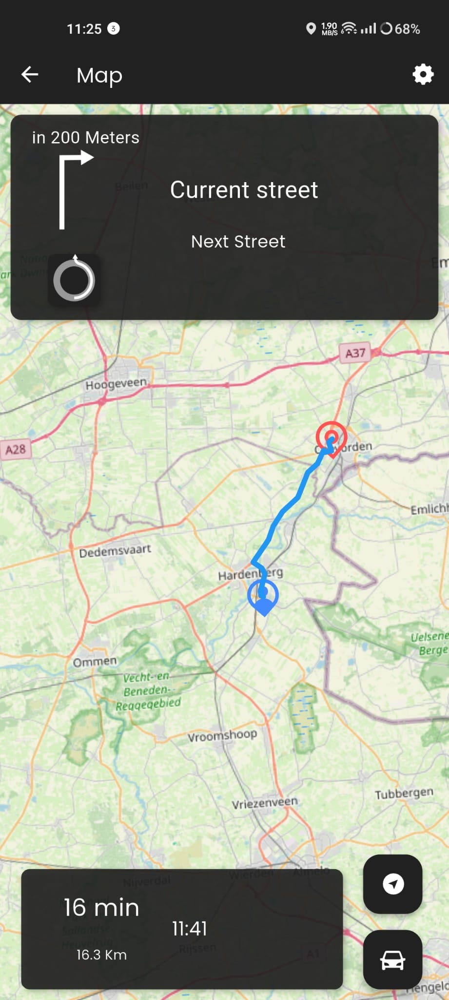

# Ford Escort – Car Control Project

## Software

### API’s
- OSRM API  
- Overpass API (OpenStreetMap)

[OSRM API Documentation](https://project-osrm.org/docs/v5.5.1/api/#general-options)  
[Overpass API Introduction](https://wiki.openstreetmap.org/wiki/Overpass_API#Introduction) 

### Frontend / Backend
- Flutter + Dart 

## Hardware

### Microcontrollers
- LilyGO TTGO T-SIM7000G ESP32 WROVER 4 MB  
- Raspberry Pi 5 (4 GB)

### Display
- [Waveshare 7 inch (1024×600)](https://www.kiwi-electronics.com/nl/merk-waveshare-electronics/7-inch-dsi-touch-display-1280x800-rpi-only-20268)  
 

### Sensors
TBA
- [Air Temperature (AM2320)](https://www.tinytronics.nl/nl/sensoren/lucht/vochtigheid/am2320-thermometer-temperatuur-en-vochtigheids-sensor)  
  

  
  

